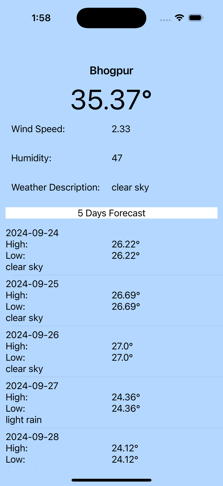

# Weather App POC

## Program Overview
The Weather App POC (Proof of Concept) is a simple iOS application developed using Swift that provides users with real-time weather information for their current location or any specified city. The app fetches data from a weather API, displaying current conditions, temperature, humidity, and a five-day forecast. This project aims to demonstrate the integration of API calls, user interface design, and basic Swift programming concepts.

## Technologies Used
- **Programming Language:** Swift
- **Frameworks:** UIKit, CoreLocation
- **API:** OpenWeatherMap API
- **Build Tool:** Xcode
- **Version Control:** Git

## Prerequisites
Before setting up the project, ensure you have the following installed:
- **Xcode** (latest version recommended)

## How to Setup and Build
1. **Clone the Repository:**
   ```bash
   git clone https://github.com/yourusername/weather-app-poc.git
   cd weather-app-poc
   ```
2. **Build and Run:**
   - Select your target device or simulator.
   - Click the Run button in Xcode or use the shortcut `Cmd + R`.

## How to Use (Usage)
1. Launch the app on your device or simulator.
2. Allow location access when prompted to get the weather for your current location.
3. Alternatively, enter a city name in the search bar and hit 'Search'.
4. View the current weather conditions and forecast displayed on the main screen.

### Screenshots

*Main screen showing weather data.*


*Search functionality for different cities.*

## Approach Taken to Craft This Program
- **Design:** The UI was designed using UIKit, focusing on simplicity and user experience. The main screen displays essential weather information in a clean layout.
- **Architecture:** The app follows the MVVM (Model-View-ViewModel) design pattern for separation of concerns.
- **Networking:** Integrated URLSession for making network requests to the OpenWeatherMap API and handling responses asynchronously.
- **Location Services:** Utilized CoreLocation to access the user’s current location for real-time weather data.

## Scope of improvement
1. Error handling needs to integrated
2. Loader needs to be intergrated in Search Screen
3. Icons and Images of better UI
4. Test cases to be written.
